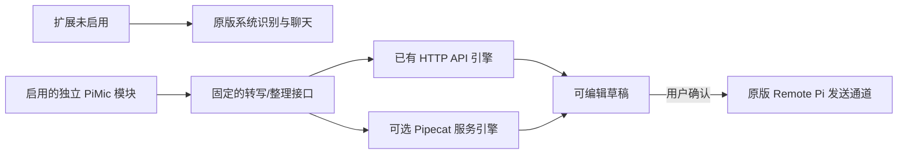

# Pipecat 与 Remote Pi 可选扩展整合评估

2026-10-04。用户明确授权两个子代理分别调研服务端与移动 SDK；本报告汇总联网文档和源码核验，区分技术可行性与尚未运行的集成。没有安装 Pipecat、调用真实模型服务、修改手机或生成集成 APK。

## 建议

可以借鉴 Pipecat，而且多提供商适配是最有价值的部分。当前阶段保留已有 HTTP 语音/整理实现和 Remote Pi 聊天，把服务端引擎做成可替换的边界；需要更多 provider 或连续流式语音时，增加独立、默认关闭的 Pipecat 后端。

手机上的新能力集中到 pimic_addons，Pipecat 属于可选 Python 服务，不加入默认启动、配对或消息发送链路。两套 API 未配置时仍使用原版系统识别、草稿与聊天；只启用整理时也能处理手工输入，无需配置语音接口。

## 已核验的能力

服务端最新发布为 [v1.12.0](https://github.com/pipecat-ai/pipecat/releases/tag/v1.12.0)。本次服务端源码参考 `c027943125c0ef7ea1b946b6c438032eb8ff0483`；后续实现应锁定实际选用版本，不把 main 的接口视为永远稳定。

| 能力 | 可借鉴或使用的位置 | 本项目仍需完成的部分 |
| --- | --- | --- |
| 多 STT/LLM 服务适配 | Gateway provider 层；官方列出 OpenAI、Deepgram、FunASR 等服务 | 选择 provider、配置凭据、验证具体模型接口及响应 |
| 自定义 base URL | OpenAISTTService / OpenAILLMService 可连接兼容内网服务 | 现有 WhisperKit、oMLX 的具体字段和行为契约测试 |
| Pipeline / FrameProcessor | 音频、转写、整理结果和取消事件的处理管线 | 收集结果成草稿，关联请求/目标，保留原文与失败状态 |
| Silero VAD、turn handling | 后续连续语音识别、分段、处理插话 | 明确按住/连续录音语义，不让模型或 turn detection 自动发送 Pi 指令 |
| 流式事件与指标 | 后续 interim transcript、识别耗时和连接状态 | Flutter 展示、事件限流、生命周期与旧结果丢弃 |
| Android 实时客户端 | 未来通过原生桥接可选 SmallWebRTC 等 transport | Flutter bridge、服务端 offer/ICE、真实录音路由与默认关闭行为 |

OpenAISTTService 以 HTTP 上传 WAV、model、language，并读取转写文本。现有 Core ML/ANE 接口可按兼容协议接入，但本次仅核验源码，没有把 Pipecat 接到真实服务上跑。LLM 服务允许自定义 base URL；普通 pipeline 默认有流式和 usage 字段，单次整理可以使用适合锁定版本的非流式调用，不能默认假定所有兼容服务接受相同扩展字段。

Pipecat 是编排框架，不提供现有 WhisperKit 的 ANE 加速，也不会因为引入框架自动降低识别延迟。Core ML/ANE 模型服务仍独立运行。

## Flutter / Android SDK 的具体边界

官方客户端列表当前有 JS、React、React Native、Swift、Kotlin、C++，没有公布可直接使用的 Flutter/Dart SDK。这不排除第三方实现，但不能把 React Native 当成 Flutter 包。

Android 官方核心包为 `ai.pipecat:client`，transport 独立发布。已核验 Android transport 包括 Daily、SmallWebRTC、Gemini Live 和 OpenAI Realtime；不同平台的 transport 支持范围不能相互套用。

- Daily 使用房间与对应基础设施；自建 bot/房间需其服务配置。
- SmallWebRTC 可自托管，不要求第三方账号；仍要实现 SDP/ICE 与 RTVI 的服务端配合。
- Gemini/OpenAI Realtime transport 面向对应实时服务，不是通用的内网 WAV 上传客户端。
- Flutter 使用 Android SDK 需要 MethodChannel/EventChannel 桥接；当前短录音 HTTP 上传不需要为了它加入 WebRTC/RTVI。

官方 push-to-talk 示例持续发送音频到 STT，按下/松开控制转写聚合，之后送 LLM/TTS。它与“按住才采集、松手上传、用户审核草稿再发送”的语义不同；可借鉴收尾/状态处理，不能直接搬过来改变用户录音和投递行为。

## 麦克风与草稿仍由自己的模块负责

SmallWebRTC 的麦克风选择代码主要处理 Earpiece/Speakerphone 及扬声器开关，不能据此证明有线/USB 输入选择可靠。独立录音插件仍要枚举真实输入，设置 preferred device，并在正在录音时核验 routed device，处理拔插、占用、权限、时长和 RMS。

没有外置麦克风时可使用内置输入；完全没有可用输入或权限时，保留文字聊天与音频导入。Pipecat 不会替无输入硬件的手机产生录音。

Remote Pi 已有合适的草稿接点：InputBar 接收转写并填入编辑框，提交时才调用 onSend；ChatPage 最终调用 vm.sendMessage。新模块复用这个接点，不改上游消息协议或配对。官方系统识别路径继续是默认实现。

## 可替换后端设计

手机只使用稳定的 `transcribe(audio)` 和 `optimize(text)` 合约。服务端配置选择 existing 或 pipecat 引擎，不让手机依赖 Pipecat 内部 Frame 类型；返回 request ID、配置 revision、原始/整理文本和状态。每次任务绑定目标及草稿 revision，切换/取消后丢弃旧结果。

STT 与整理 provider 分开配置，API 地址/model ID 均可替换。第一版先支持已有 OpenAI 兼容接口；Pipecat 后端按实际需要接入额外 provider，每种都通过单独契约测试。未启用的 provider 不应初始化、下载模型或请求公网服务。

Pipecat pipeline 不强制 WebRTC 或 TTS，可用自定义 processor/sink 返回文字。不过 HTTP 文件上传、认证、配置管理、请求去重和草稿结果封装仍由我们编写，不是安装框架即可获得的完整应用功能。

## 环境、资源与维护

- Python 要求至少 3.11，与现有 Python 版本相容；建议独立 Pixi manifest 和 lock，按需选 provider extras，不安装全部可选依赖，也不影响默认 Gateway 环境。
- 当前服务端代码推荐 PipelineWorker/WorkerRunner；旧 PipelineTask/PipelineRunner 已是弃用别名。不要直接套用早期教程的 VAD/transport 参数。
- 所核验的部分 STT/processor 内部队列未设置容量，音频段缓存也需要我们设置时长和并发策略。只有外层上传限制不足以证明内部积压有界；采用完整实时管线前需验证背压、取消和资源上限。
- 服务端、Android 核心与 transport 的许可证为 BSD-2-Clause；复用代码保留对应版权和许可，底层依赖分别核验。Remote Pi 手机子包本身的许可声明不一致仍是独立事项，不因使用 Pipecat 而改变。
- 后续完全内网的实时方案需明确 ICE/STUN 配置与启动采集开关，不能直接沿用 SDK 的默认麦克风/公网 STUN 行为。

## 分阶段采用

1. 完成 default-off addon 基线：无配置与双开关组合回归，独立包的上游连接可用。
2. 使用已实现的 HTTP 客户端跑通短录音和可选整理，生成可审核草稿。
3. 按需求增加独立 Pipecat 后端，先用假服务验证 WAV/LLM 字段、超时、取消和错误，不触及用户真实 Pi 会话。
4. 对同一批真实音频比较 HTTP 引擎与 Pipecat 引擎的识别、总耗时、并发和资源占用；不能以框架名字推测性能。
5. 需要连续 partial transcript、更多 streaming provider 或实时交互时，再接可选实时 transport，并保留原有草稿/发送边界。

## 主源证据

- [Pipecat 框架与官方服务列表](https://github.com/pipecat-ai/pipecat)。
- [OpenAI STT 文档及自定义 base URL](https://docs.pipecat.ai/api-reference/server/services/stt/openai)。
- [OpenAI LLM 文档](https://docs.pipecat.ai/api-reference/server/services/llm/openai)。
- [STT 源码](https://github.com/pipecat-ai/pipecat/blob/c027943125c0ef7ea1b946b6c438032eb8ff0483/src/pipecat/services/openai/stt.py)、[LLM 源码](https://github.com/pipecat-ai/pipecat/blob/c027943125c0ef7ea1b946b6c438032eb8ff0483/src/pipecat/services/openai/base_llm.py)。
- [Pipeline](https://docs.pipecat.ai/pipecat/learn/pipeline)、[自定义 processor](https://docs.pipecat.ai/pipecat/fundamentals/custom-frame-processor)。
- [Python 要求与依赖](https://github.com/pipecat-ai/pipecat/blob/c027943125c0ef7ea1b946b6c438032eb8ff0483/pyproject.toml)、[服务端许可](https://github.com/pipecat-ai/pipecat/blob/c027943125c0ef7ea1b946b6c438032eb8ff0483/LICENSE)。
- [官方客户端列表](https://docs.pipecat.ai/client/introduction)、[Android SDK](https://docs.pipecat.ai/api-reference/client/android/overview)。
- [Android 核心](https://github.com/pipecat-ai/pipecat-client-android)、[Android transports](https://github.com/pipecat-ai/pipecat-client-android-transports)。
- [SmallWebRTC 设备接口源码](https://github.com/pipecat-ai/pipecat-client-android-transports/blob/main/pipecat-client-android-small-webrtc-transport/src/main/java/ai/pipecat/client/small_webrtc_transport/SmallWebRTCTransport.kt#L353)。
- [官方 push-to-talk 示例](https://github.com/pipecat-ai/pipecat-examples/blob/main/push-to-talk/README.md)。
- [STT 队列与音频缓存](https://github.com/pipecat-ai/pipecat/blob/c027943125c0ef7ea1b946b6c438032eb8ff0483/src/pipecat/services/stt_service.py)、[processor 队列](https://github.com/pipecat-ai/pipecat/blob/c027943125c0ef7ea1b946b6c438032eb8ff0483/src/pipecat/processors/frame_processor.py)。
