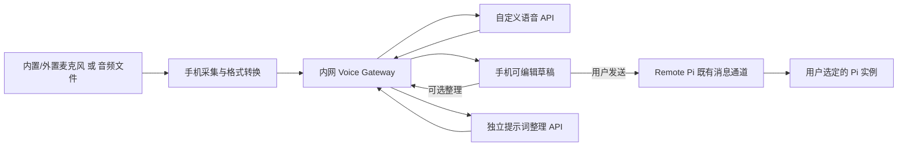

# PiMic Remote：可配置内网语音与提示词整理

状态：设计方案，尚未实现为 APK。2026-10-04 已创建 `hotwa/remote_pi`，保留上游 main；改造先从独立开发包和基线连接验收开始。

## 首要约束：未配置时保持原版行为

新增能力必须可选。新安装没有任何 PiMic 配置时，直接使用上游手机系统识别、草稿、发送、配对、目标选择、队列和流式回复；不要求用户配置 Gateway、STT API 或整理 API 才能使用原版功能。原版自身对麦克风、系统识别器和配对的要求继续适用，不承诺绕过原版设备限制。

新增 STT 和提示词整理分别有独立的 enabled 开关，默认 false。保存 API 地址不等于启用。缺失或损坏的扩展配置按扩展关闭处理，不阻止应用启动或改变上游设置。

| 用户启用情况 | 识别路径 | 提示词整理 | 原版聊天 |
| --- | --- | --- | --- |
| 无配置，或两个开关均关闭 | 上游系统识别 | 不调用整理模型 | 原样可用 |
| 只启用内网 STT | 自定义 STT | 原始转写直接进草稿 | 原样可用 |
| 只启用提示词整理 | 上游系统识别；打字也可 | 用户可对草稿调用整理 | 原样可用 |
| 两者都启用 | 自定义 STT | 用户可对转写草稿调用整理 | 原样可用 |
| 内网请求失败 | 保留草稿、显示错误，可手动切回系统识别 | 保留原文，不自动发送 | 文字输入、发送等仍可用 |

扩展关闭时不能初始化内网音频采集、请求额外权限、探测 Gateway 或请求模型。网络客户端和设备适配器按功能实际启用后延迟创建。新增菜单只作为设置中的可选入口；聊天界面没有配置催促、阻塞向导或默认整理步骤。

不要在没有整理 API 时偷偷调用 Pi 执行模型进行改写。这会产生真实会话轮次且改变原版语义；缺少整理 API 就保持原文和原有发送路径。

## 目标与结构

手机复用 Remote Pi 的目标选择、聊天、草稿、发送、队列和流式回复；音频与提示词整理由独立内网 Gateway 处理，结果只回到草稿。Gateway 不为这条手机聊天路径另起 Pi 进程，也不自动执行整理后的文本。



负责识别的机器、负责整理的机器与运行目标 Pi 的机器可以不同。模型 API 的 base URL 和 model ID 可配置，不固定某一台机器、某个模型或公网供应商。

## 输入设备适配

| 实际情况 | 行为 |
| --- | --- |
| 没有外置麦克风 | 使用可用的手机内置输入，显示真实录音路由 |
| 接入有线、USB 等外置输入 | 自动模式按可用设备选择，也提供手动输入选择；开始采集后核对实际路由 |
| 蓝牙输入 | 按系统支持的录音路由适配并实测；不能把蓝牙耳机连接状态当作录音成功 |
| 没有可用输入、权限被拒绝或麦克风被其他应用占用 | 保持文字聊天可用，提供音频文件导入；显示具体状态，不反复强求授权 |
| 录音中拔出设备或目标发生变化 | 结束/取消当前采集，标记变化，丢弃过期异步结果；不继续自动投递 |

完全没有音频输入硬件时，软件不能产生录音。音频导入可使用别处录制的文件；首版仅支持受限长度的 WAV，后续再加入其他格式解码。

首版是前台按住说话，不自动后台开启录音。采集 PCM16 单声道，必要时从实际采样率转换为 16 kHz，最长 60 秒。音量波形使用真实 RMS。连续录音/VAD、锁屏常驻和蓝牙分别做后续验收，不从首版按住说话推断它们已可用。

## 手机配置页面

配置按用途拆开，不能把识别、整理和 Pi 执行模型混成一个模型选择器。

| 配置组 | 字段 |
| --- | --- |
| 连接 | Gateway 地址、连接状态、已绑定状态 |
| 音频输入 | 自动/指定输入、实际路由、按住说话模式 |
| 语音识别 | 后端（手机系统/内网 API）、配置名称、协议适配器、base URL、model ID、语言、超时、术语提示、服务端凭据状态 |
| 提示词整理 | 开关、独立配置名称、base URL、model ID、超时、整理模板、服务端凭据状态 |
| 目标 Pi | 使用 Remote Pi 的已有目标选择；持续显示机器/项目/运行实例信息 |

提供“检查连接”“测试这段音频”“测试整理文本”三个不同操作。连接成功不等于识别准确；测试操作不向 Pi 发送指令，也不偷偷上传预录音。

建议 Gateway 保存 API 配置与凭据引用，手机选择 profile，并在有管理权限时修改非敏感字段。两个模型密钥分别引用服务端环境或受保护的凭据存储；普通配置返回只能包含 `credential_configured`，不能返回密钥本身。应用连接凭据保存在自身安全存储中，首次绑定后不需每次输入令牌。

手机直连模型 API 可以作为后续可选模式，届时须将 API 凭据放入安全存储；首版走 Gateway，复用已有 STT/整理客户端并统一管理配置。

## 模型协议范围

首版支持 OpenAI 兼容协议：

- STT：`POST <base_url>/audio/transcriptions`，multipart 文件与 model/language 等字段，至少返回 `{"text":"..."}`。
- 整理：`POST <base_url>/chat/completions`，system/user 消息、`stream=false`，返回 assistant 文本。
- base URL 通常包含 `/v1`，不让用户重复填写完整 endpoint；测试时分别校验地址、模型 ID、认证状态和响应结构。

任意 REST 服务不一定兼容这些协议。后续增加有名字的 provider adapter，明确上传方式与响应结构；不能仅改 URL 就宣称支持所有接口。WhisperKit 包装接口、兼容的语言模型服务分别接入。

## Gateway 接口草案

以下接口是拟新增的设计，不是当前已有接口。现有 UDP/VAD 和已有 APK 保持可用；新增 HTTP 路径复用后端实现。

| 接口 | 用途 |
| --- | --- |
| GET `/api/voice/capabilities` | 可用协议、格式、长度和上传限制 |
| GET `/api/voice/profiles` | 不含密钥的识别/整理配置列表与 revision |
| PUT `/api/voice/profiles/{id}` | 经授权更新配置，使用 revision 避免覆盖并发修改 |
| POST `/api/voice/profiles/{id}/test` | 显式测试配置；不投递 Pi |
| POST `/api/voice/transcriptions` | 音频、profile ID、request ID；返回原始转写 |
| POST `/api/voice/optimize` | 草稿、profile ID、request ID；返回整理结果 |

配置更改先验证再原子保存。每次请求固定 profile revision，不能在执行途中换另一套 URL、模型或凭据。请求采用有界音频/文本大小、有界队列和超时；同一 request ID 的重复请求复用短期结果或返回处理中，不创建多份并发工作。网络重试不触发 Pi 投递。

调用地址由 Gateway 解释，因此 Gateway 的 localhost 是服务端本机，而非手机。仅连接配置允许的模型节点；内网明文 HTTP 与 TLS 分别按 Android 网络策略配置，敏感配置操作使用受保护的连接。

## 提示词整理规则

- 默认为关闭，用户也可以在单条草稿上点击整理。
- 可以去除口头重复、修正表达结构和保留技术符号；不能可靠补回 ASR 遗漏的事实。
- 原文始终保留，可对比、编辑和恢复；失败只显示错误并保留草稿，不自动发送原文。
- 模型只接收用户选择整理的文字，不自动附带项目文件、工具权限或完整聊天历史。
- 不增加任务或执行范围，保留“不要修改”“只报告”等限制；停止/取消不由整理模型决定。
- Pi 的执行模型仍由 Pi 配置，整理模型的选择不会更改目标 Pi 的模型。

## 异步状态与投递

状态为：空闲 → 录音 → 识别 → 草稿 → 可选整理 → 草稿 → 用户发送。录音、识别与整理使用同一输入 ID，并绑定开始时的目标实例、会话及草稿 revision。

导航、目标切换、会话更新、取消录音或用户改写草稿后，旧任务不能覆盖新草稿。即使 HTTP 请求已经发出且无法立即停止，也要丢弃晚到结果。发送仍由 Remote Pi 原有客户端处理；接受、排队、运行和完成分别展示，不把 HTTP 成功当作 Pi 已完成任务。

## 代码改动分工

- 手机后端：增加 Gateway 客户端、profile 模型和内网 SpeechService 实现，保持上游已有依赖注入方式。
- 原生 Android：增加 AudioRecord 适配器、输入设备发现、真实路由与采样率处理，复用已验证的有线采集经验。
- 手机 UI：沿用 InputBar、VoiceInputViewModel、RecordingStrip，增加配置页和整理草稿状态；不重新实现整套消息协议。
- Gateway：复用 OpenAISttBackend、PromptOptimizer，新增独立上传/整理入口和配置管理。现有实时自动投递流程与新草稿流程明确分开，不能复用错误的自动发送副作用。
- 构建：独立包名、固定签名、独立更新来源，使用 Pixi 的 `pixi.toml` 管理工具链与测试/构建任务；Dart 依赖使用上游 pubspec 和 lock。

## 独立模块与补丁维护

大部分实现放在新增目录，不散落进上游核心类：

```text
app/packages/pimic_addons/   # 独立功能包、配置存储、Gateway 客户端、原生音频插件
app/lib/pimic_bridge/        # 对上游 SpeechService、草稿动作的薄适配
app/test/pimic_bridge/       # 默认关闭和最小接入点回归
pimic/                      # Pixi 工具链、上游版本记录、补丁导出/检查工具
```

功能包定义自己的接口，不直接依赖上游 ChatViewModel、Relay 或 Pi 协议类。宿主 adapter 才依赖上游 SpeechService；内网后端关闭时委托上游实现，保持其原有权限、语种、开始/停止/取消行为。原生 AudioRecord 作为独立 Flutter 插件注册，不把采集逻辑写进上游 MainActivity。

提示词整理作为草稿工具：用户调用后返回原文/整理结果，确认后替换编辑框文字，再使用原有发送按钮。不要把所有 onSend 调用改成必须经过 async 整理，不改变图片附件发送、排队、纠正或停止协议。

预期仅少量宿主接点需要补丁：依赖声明、服务注册、设置入口，以及输入栏可选草稿工具的入口。具体接点须在编码时核验上游源码和生命周期；未配置时入口返回空/原实现，不能破坏原有组件。`SpeechToTextService`、ChatViewModel、消息 wire types、Relay、Pi 插件和身份存储保持原有实现。

补丁组织为可审查的系列：

1. 新增独立功能包及其测试。
2. 最小宿主 adapter 与接入点。
3. 独立包名/签名/更新来源的打包配置，和业务逻辑分开。

fork 的 main 跟随上游；实际功能开发放在专门的 addon 分支，不把设计分支当成完成的功能。记录上游 commit，导出 git format-patch 补丁系列。更新上游时先在独立检出中做应用检查，再运行上游和扩展回归；存在冲突时修复接入点，不覆盖或重写上游核心功能。不能保证未来永远零冲突，目标是把冲突限制到少数接点。

运行时关闭开关即可恢复上游行为，不依赖卸载 APK、删除配对或重新配置 Relay。补丁本身也须支持移除后构建原版。源码中的可选功能不等于可随意延后类型/依赖错误：含扩展的 APK 必须完整通过构建和测试。

## 默认行为回归标准

- 空配置/损坏配置/保存但未启用的配置：上游启动与聊天正常，新增 Gateway/STT/整理请求次数为零。
- 两个 enabled 开关四种组合：互不依赖，关闭整理不阻塞识别或发送；关闭 STT 仍可整理打字/原版语音草稿。
- 原版语音、图片附件、排队、纠正、停止、目标切换、配对与会话同步测试继续通过。
- 关闭扩展或切换目标时取消扩展任务；旧结果不覆盖草稿或投递到新目标。
- 内网服务离线、请求超时、格式不兼容：原始草稿和上游文字聊天可继续使用，不出现重复发送。
- 升级新增配置只处理 pimic 命名空间，不迁移、重置或读取上游身份私钥；卸载补丁不得删除上游用户数据。

这些是待实现功能的验收标准，本次更新只强化设计约束，并未声称测试已在改版 APK 上通过。

## 开发顺序与完成条件

1. 基线：从固定上游版本生成独立包，确认扫码、目标选择、文字发送、流式回复和重启恢复。
2. 内网识别：一个可配置 profile，按住录音 → WAV → Gateway → 转写草稿；确认内置和有线输入。
3. 配置与整理：手机管理两个独立 profile，测试接口，原文/整理结果对比，错误时保留草稿。
4. 无麦克风与稳定性：拒绝权限、无输入、音频导入、设备拔插、目标切换、超时和断网场景。
5. 多目标：在独立测试实例中验证不同机器上的 Pi；再考虑连续模式、锁屏和其他音频格式。

基线与新功能需分别通过测试。上游许可证声明的不一致、独立签名导致重新绑定等事实保留在 fork 可行性研究中；本设计不会修改上游版权或许可声明。

## Pipecat 可选整合研究

两个子代理已分别核验服务端和移动 SDK。建议保留手机 addon 与稳定的转写/整理接口，把 Pipecat 作为可选服务端引擎；当前 HTTP 草稿流程先复用现有后端。官方目前未公布 Flutter SDK，不能直接把 Android 实时 transport 当作 Flutter WAV 上传模块。多 provider、连续识别和流式事件是后续可利用的能力，默认关闭与原版行为约束继续适用。[完整研究与源码依据](https://github.com/hotwa/remote_pi/blob/pimic/voice-plan/docs/PIMIC_PIPECAT_ASSESSMENT.md)。
